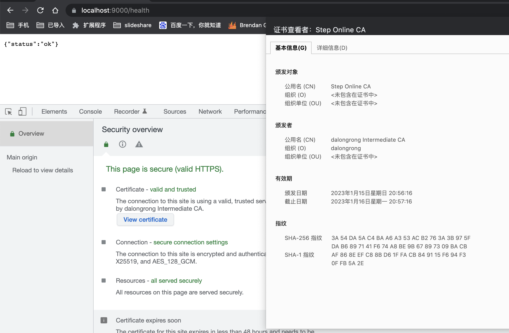

# smallstep/step-ca learning

## running

```code
docker-compose up -d 
```

## generate  localhost  cert

> inside container docker exec -it sh <containerid>

```code
step ca certificate localhost localhost.crt localhost.key
```

## export  root ca

> inside container docker exec -it sh <containerid>

```code
step ca root root_ca.crt
```

## install root ca

> click  root_ca.crt in step dir

## view step endpint

```code
curl -i  https://localhost:9000/health
```




## some notes

> maybe nedd passowrd, can check docker logs -f <containerid>